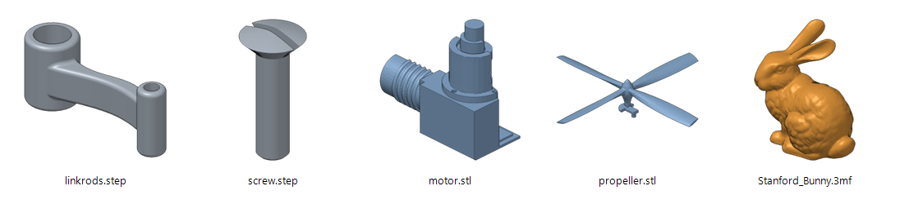
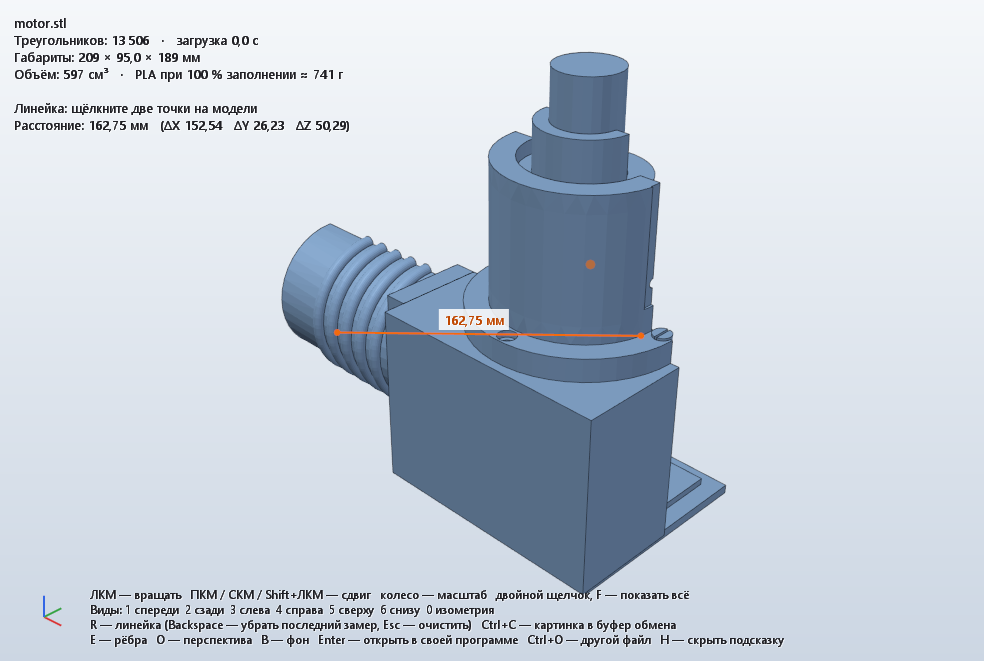

# CadThumb — эскизы STEP / 3MF / STL в Проводнике Windows

[](../../actions/workflows/build.yml)
[](LICENSE)



> **English.** CadThumb adds thumbnails for **STEP (.step/.stp)**, **3MF** and optionally **STL** files to Windows 10/11 File Explorer, plus a lightweight 3D viewer (rotate/pan/zoom, edges, dimensions, a ruler with vertex snapping, volume and PLA weight estimate). STEP files are tessellated with OpenCASCADE; 3MF uses the picture embedded by the slicer or renders the model. Rendering runs in a separate process with memory and time limits, so Explorer never hangs or crashes because of a heavy file. Download `CadThumb-Setup-x.y.z.exe` from [Releases](../../releases/latest), no admin rights needed. The documentation below is in Russian. Contact: [GitHub Issues](../../issues), Telegram [@giminot](https://t.me/giminot).

Проводник показывает эскизы моделей `.step`, `.stp` и `.3mf` (и, по желанию, `.stl`) прямо в папках, открывать CAD или слайсер не нужно. В комплекте есть лёгкий 3D-просмотрщик с линейкой.

## Скачать

Установщик: **[Releases → CadThumb-Setup-x.y.z.exe](../../releases/latest)** (Windows 10/11 x64).

Установщик не подписан цифровой подписью, поэтому SmartScreen может предупредить о неизвестном издателе: «Подробнее» → «Выполнить в любом случае». Рядом с установщиком лежит файл `.sha256` с контрольной суммой.

## Установка на другие компьютеры

`.\build.ps1` собирает один файл **`dist\CadThumb-Setup-<версия>.exe`** (~16 МБ). Внутри уже есть программа и движок OpenCASCADE, поэтому на целевом ПК не нужны ни Visual Studio, ни vcpkg, ни VC Redist. Достаточно Windows 10/11 x64.

Двойной клик открывает окно с выбором:
* **«Установить для меня»** — без прав администратора, в `%LOCALAPPDATA%\Programs\CadThumb`;
* **«Установить для всех пользователей»** — в `Program Files`, Windows запросит права администратора;
* флажок **«Также .stl»**.

Программа появляется в «Параметры → Приложения → Установленные приложения» и удаляется оттуда. При удалении можно отдельно удалить настройки и кэш.

Тихая установка (скрипты, развёртывание на нескольких ПК):

```
CadThumb-Setup-1.0.0.exe /S                 для текущего пользователя, STEP + 3MF
CadThumb-Setup-1.0.0.exe /S /STL /MACHINE   для всех пользователей, плюс STL
                         /NOMENU /NOAUTOSTART   без пункта контекстного меню / без автозапуска
                         /RESTARTEXPLORER       перезапустить Проводник в конце (эскизы сразу и на рабочем столе)
CadThumbSetup.exe /uninstall /S [/PURGE]    удаление (команда есть в записи «Установленные приложения»)
```

Уже запущенный Проводник, особенно рабочий стол, запоминает, что для `.step` обработчика эскизов нет, и до перезапуска не спрашивает CadThumb. Поэтому последнее окно установщика предлагает **«Перезапустить Проводник сейчас»**. Перезапуск идёт через Restart Manager: панель задач мигнёт, окна папок закроются. Если отказаться, на рабочем столе эскизы появятся после следующего входа в Windows. Отдельно: `CadThumb.exe --restart-explorer`.

Повторный запуск установщика обновляет программу поверх: регистрация переключается на новую версию, старая удаляется, когда Проводник её отпустит. Фоновый сервис запускается через Проводник. Поэтому установщик не ждёт его завершения, в том числе при `Start-Process -Wait`, а при установке «для всех» сервис работает с обычными правами пользователя, а не администратора.

## Сборка из исходников

Нужны Windows 10/11 x64, Visual Studio 2022 с компонентом «Разработка классических приложений на C++», CMake 3.21+ и [vcpkg](https://github.com/microsoft/vcpkg) (путь к нему — в переменной `VCPKG_ROOT` или параметре `-VcpkgRoot`). Версия OpenCASCADE — 8.0.0; в CI vcpkg зафиксирован на коммите из [.github/workflows/build.yml](.github/workflows/build.yml).

Каждый push собирает установщик в GitHub Actions. Тег `vX.Y.Z` (версия должна совпадать с `project(... VERSION ...)` в `CMakeLists.txt`) публикует релиз с установщиком и его SHA-256.

## Сборка и установка на этом ПК (для разработки)

```powershell
.\build.ps1            # первый раз: vcpkg соберёт OpenCASCADE (~20 мин), дальше — секунды
.\install.ps1          # установить из build\ (то же, что установщик, но без записи в «Установленных приложениях»)
.\install.ps1 -Stl     # плюс STL (заменит текущий STL-обработчик, например от QIDI Studio)
.\uninstall.ps1        # удалить (-Purge — вместе с настройками и кэшем)
```

После установки:
* в трее появится значок CadThumb, он автоматически запускается при входе в Windows;
* в контекстном меню моделей появится пункт **«Обновить эскиз (CadThumb)»** (в Windows 11 он находится в «Показать дополнительные параметры»).

## 3D-просмотрщик

Правый клик по модели → **«Просмотр 3D (CadThumb)»** (в Windows 11 — в «Показать дополнительные параметры»), либо «Открыть с помощью → CadThumb — просмотр 3D», либо значок в трее → «Открыть 3D-модель…». Двойной клик по-прежнему открывает файл в вашей CAD-программе или слайсере.

| Действие | Управление |
|---|---|
| Вращать | ЛКМ |
| Сдвинуть | ПКМ, СКМ или Shift+ЛКМ |
| Масштаб | колесо |
| Показать всё | двойной щелчок или F |
| Виды | 1 спереди, 2 сзади, 3 слева, 4 справа, 5 сверху, 6 снизу, 0 изометрия |
| Рёбра / перспектива / тёмный фон | E / O / B |
| Открыть в своей программе | Enter |
| Другой файл | Ctrl+O или перетащить файл в окно |
| Линейка | R, затем щелчки по двум точкам; Backspace — убрать последний замер, Esc — очистить все |
| Картинка вида в буфер обмена | Ctrl+C (без подсказок, с замерами) |



**Линейка.**
* Если рядом с курсором (до 10 пикселей) есть видимая вершина ребра — угол, край отверстия, граница грани, — точка привязывается к ней: маркер становится зелёным. Иначе берётся точка поверхности под курсором.
* Показываются расстояние и разбивка по осям ΔX/ΔY/ΔZ с точностью 0,01 мм.
* Перетаскивание мышью в режиме линейки по-прежнему вращает вид.

**Объём и вес.** Считаются по поверхности модели. Вес дан для PLA (1,24 г/см³) при 100 % заполнения, то есть это верхняя граница. Реальный вес печати зависит от заполнения и периметров. Если модель не замкнута (дыры в STL), рядом появляется пометка «объём приблизительный».

* Вверху показаны число треугольников, время загрузки и габариты в мм.
* STEP тесселируется точнее, чем для эскизов, чтобы модель выглядела гладко при приближении.
* Острые рёбра и границы вычисляются для любых форматов, включая STL.
* Рисование идёт через OpenGL со сглаживанием (MSAA), модель хранится в видеопамяти, поэтому вращение плавное даже на моделях в сотни тысяч треугольников.

## Как это устроено

```
Проводник ──COM──► CadThumbShell.dll  (IThumbnailProvider + IInitializeWithStream, 300 КБ)
                     │ 1. 3MF: эскиз, сохранённый слайсером (Metadata/*.png) → сразу
                     │ 2. собственный кэш %LOCALAPPDATA%\CadThumb\cache → сразу
                     │ 3. иначе: named pipe → CadThumb.exe (фоновый сервис, трей)
                     ▼
               CadThumb.exe --host      очередь, дедупликация, лимит параллельных рендеров
                     │ отдельный процесс на каждую модель (job object: лимит памяти, таймаут, низкий приоритет)
                     ▼
               CadThumb.exe --render    STEP → OpenCASCADE (XCAF, цвета, тесселяция)
                                        3MF  → miniz + pugixml (сборки, компоненты, production-расширение, цвета)
                                        STL  → бинарный/ASCII
                                        → программный растеризатор (z-буфер, SSAA 3×, контуры) → PNG
```

| Компонент | Что делает |
|---|---|
| `src/shellext` | DLL для Проводника. В ней нет OpenCASCADE: только кэш, pipe и встроенные эскизы 3MF. |
| `src/app` | `CadThumb.exe`: сервис в трее, pipe-сервер, очередь, подготовка папок, регистрация, CLI. |
| `src/render` | Загрузчики STEP/3MF/STL и CPU-растеризатор. |
| `src/viewer` | 3D-просмотрщик (`CadThumb.exe --view`): OpenGL-окно, выделение рёбер, вписывание вида. |
| `src/common` | Настройки, кэш и ключи, ZIP, WIC (PNG), протокол pipe, реестр. |
| `src/tools/thumbtest` | Прогон обработчика так же, как это делает Проводник (напрямую или через shell). |
| `src/installer` | `CadThumbSetup.exe`: однофайловый установщик/деинсталлятор (программа вшита как ресурсы). |

## Нюансы и принятые решения

**Скорость STEP.** STEP хранит точную геометрию (B-rep), поэтому её надо транслировать и триангулировать. Реальные замеры на этой машине:

| Модель | Размер | Время |
|---|---|---|
| Детали из Fusion | до 1 МБ | 0,1–0,4 с |
| Hotend Q1 | 31 МБ | 10 с |
| Модель | 87 МБ | 32 с |
| Сборка QIDI Q1 Pro | 144 МБ | 160 с |

Бо́льшая часть времени уходит на однопоточную трансляцию в OCCT. Отключение «лечения» геометрии и чтения цветов время не сокращает (проверено замерами). Поэтому:
* Проводник ждёт не больше `HandlerWaitSec` (15 с). Если рендер не успел, он продолжается в фоне, и эскиз появится при следующем открытии папки или по F5. Неудача Проводником не запоминается (проверено).
* Для папок с тяжёлыми моделями есть пункт трея **«Подготовить эскизы для папки…»** и команда `CadThumb.exe --prewarm <папка>`.
* Жёсткий предел — `RenderTimeoutSec` (300 с), после него процесс рендера убивается. Неудачи кэшируются на `FailRetryHours`, чтобы не жечь CPU при каждом открытии папки.

**Изоляция.** Windows умеет запускать обработчики эскизов в изолированном `dllhost`, но этот суррогат видит только регистрации из HKLM. При установке для пользователя (HKCU) он возвращает `REGDB_E_CLASSNOTREG` — это проверено. Поэтому:
* установка «для пользователя» ставит `DisableProcessIsolation=1`, как это делают обработчики Microsoft 3MF и QIDI STL, и DLL работает внутри Проводника;
* DLL при этом минимальна: весь разбор файлов идёт в отдельном процессе. Вызов обёрнут в SEH, чтобы исключение не уронило Проводник;
* `install.ps1 -Machine` (от администратора) регистрирует в HKLM и сохраняет изоляцию.

**Обновление без перезапуска Проводника.** Загруженную DLL нельзя перезаписать. Поэтому каждая установка идёт в новую папку `app-<время>`, регистрация переключается на неё, а старые папки удаляются, когда освободятся.

**3MF.** Сначала используется картинка, которую сохранил слайсер: `_rels/.rels` → thumbnail, `Metadata/thumbnail.png`, `Metadata/plate_1.png` (Bambu/Orca/QIDI). Маски `pick_*` и `*_small` пропускаются. Если картинки нет, модель рендерится: `build/item`, компоненты, `p:path` на другие `.model` в пакете (Bambu), трансформации, цвета `basematerials`/`colorgroup`. Поставьте `Prefer3mfEmbedded=0`, чтобы всегда рендерить модель.

**Цвета и ориентация STEP.**
* Цвета граней и сборок берутся из файла (XCAF). Слишком тёмные «стальные» цвета осветляются, иначе на маленьком эскизе получается чёрное пятно.
* Вертикальная ось по умолчанию определяется автоматически (`UpAxisStep=auto`): для SolidWorks/Inventor/Creo это Y, для остальных (Fusion, КОМПАС/C3D, CATIA, NX, FreeCAD) — Z.

**Кэш.**
* Ключ строится из размера, даты изменения и выборок содержимого (начало, конец и 4 фрагмента из середины), типа, размера эскиза и настроек рендера. Имя файла в ключ не входит: копия файла попадает в кэш сразу.
* Кэш переживает очистку кэша эскизов Windows, которую Windows время от времени делает сама.
* Объём кэша ограничен `CacheMaxMB`, старые записи вытесняются.

**Безопасность pipe.**
* Доступ к каналу есть только у текущего пользователя и SYSTEM. Удалённые клиенты отклоняются.
* Метка целостности Low: клиент может работать и в процессе с пониженной целостностью.
* Файл передаётся через pipe, поэтому клиенту не нужно право записи в наши папки.

**Уже закэшированные эскизы.** Проводник хранит свою копию эскизов, поэтому старые картинки от других обработчиков (например, Microsoft 3MF) останутся, пока файл не изменится. Обновить их можно так:
* пунктом «Обновить эскиз (CadThumb)» (использует `IThumbnailCache` с `WTS_FORCEEXTRACTION`);
* подготовкой папки из трея;
* через «Очистку диска» → «Эскизы».

## Настройки

`%LOCALAPPDATA%\CadThumb\settings.ini`. Открывается из трея и применяется на лету. Все параметры прокомментированы в самом файле: таймауты, параллельность, лимит памяти, качество тесселяции, углы обзора, цвета, фон, контуры.

## Командная строка

```
CadThumb.exe                              фоновый сервис (трей)
CadThumb.exe --register [--stl] [--machine] [--no-menu] [--no-autostart]
CadThumb.exe --unregister [--machine]
CadThumb.exe --refresh <файл> [...]
CadThumb.exe --prewarm <папка>
CadThumb.exe --render <вход> <выход.png> [--size N] [--type step|3mf|stl]
CadThumb.exe --status | --stop | --clear-cache
```

Проверка без регистрации:

```
thumbtest.exe build\bin\Release\CadThumbShell.dll model.step out.png 256
```

Проверка через настоящий конвейер Windows (после регистрации):

```
thumbtest.exe --shell model.step out.png 256
```

Журнал: `%LOCALAPPDATA%\CadThumb\cadthumb.log` (подробный режим — `VerboseLog=1`).

## Автор и обратная связь

* GitHub: [@GNUGiminot](https://github.com/GNUGiminot) — ошибки и предложения лучше оставлять в [Issues](../../issues)
* Telegram: [@giminot](https://t.me/giminot)

## Лицензия

Код CadThumb распространяется по лицензии MIT, см. [LICENSE](LICENSE).

Готовые сборки статически включают сторонние библиотеки, подробности в [THIRD_PARTY_NOTICES.md](THIRD_PARTY_NOTICES.md):
* **OpenCASCADE** — LGPL 2.1 с исключением Open CASCADE. Исходники CadThumb и скрипты сборки открыты, поэтому программу можно пересобрать с изменённой версией OCCT. Чтобы подключить OCCT динамически, соберите с триплетом `x64-windows`.
* **miniz** и **pugixml** — MIT.
